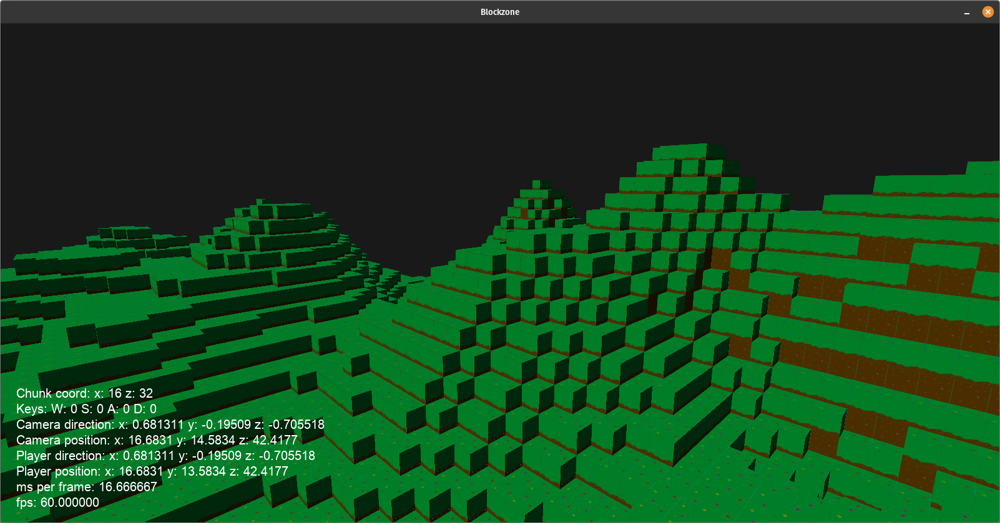

# blockregion

A minecraft style game built entirely from scratch.

**Table of Contents**

- [Building](#building)
  - [Linux](#linux)
  - [Windows](#windows)
- [Release Notes](#release-notes)

---

# Building

## Linux

Install dependencies using your native package manager.
```
sudo apt install \
    git \
    make \
    cmake \
    gcc-c++ \
    libgl-dev \
    libglu1-mesa-dev \
    libxinerama-dev \
    libxcursor-dev
```

Clone the repo and navigate into the base directory.
```
cd /path/to/blockregion/
```

Create build directory.
```
mkdir build
cd build
```

Create CMake project.
```
cmake ..
```

Build `blockregion`.
```
make -j blockregion
```


## Windows

TODO: Add instructions for Windows build

# Release Notes

## v0.2.0 Rendering Engine



- Created Rendering Engine with API to register objects to be rendered, and all the rendering logic is abstracted
- Moved texture tile coordinates to come from new texture system and configured from JSON
- Removed all rendering logic that was imbended within world, chunk, and block classes
- Incorporated text rendering into common loading and rendering pipelines
- Added spdlog to handling logging needs

## v0.1.0 Shader and Texture Revamp

Updated old shader and texture code to abstract dependencies and be more modular using the CRTP.
- Created a Block and Text shader
- Removed absolute paths and referenced to git repo base
- Made texture loader with error checking
- Windows build support
- Improved build system with top level CMake
- Added `errors` wrappers for `std::expected`
- Shaders do error checking

## v0.0.0 Blockzone port

Transferred [Blockzone](https://github.com/joel22b/Blockzone) project to build on Linux as a base for this project.

Goals:
- Develop clean, modular code
- Clean up project and fix long standing bugs
- Implement a multiplayer system from scratch
- Better world generation with rivers, mountains, and biomes
- Menus and settings
- Better lighting system
- Skybox and clouds
- Saving game system
- Creatures
